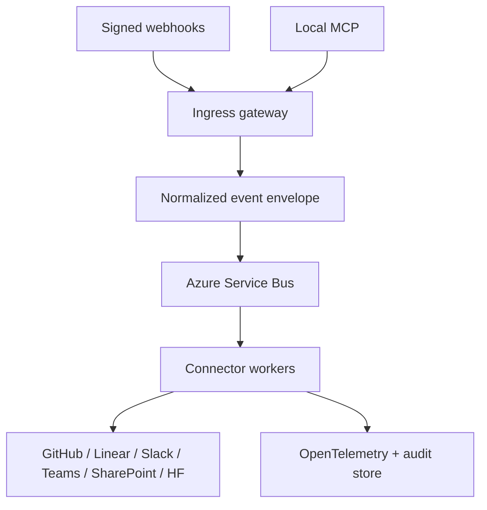

# Helios Connect architecture

## North star

One secure nervous system connects Helios engineering, planning, communication,
documents, and models without making any SaaS product the master of all state.

## System spine

- GitHub owns code, CI, releases, and deployment manifests.
- Linear owns planned work and delivery status.
- SharePoint owns human-facing governed documents.
- Hugging Face owns model, dataset, Space, and evaluation artifacts.
- Slack and Teams are notification and interaction surfaces, never source-of-truth stores.
- Azure provides managed identity, Key Vault, Service Bus, Container Apps, Storage, and monitoring.
- Local MCP exposes the same allowlisted actions to Codex and the Monado GUI.

## Contracts

Every event has `id`, `type`, `source`, `subject`, `occurredAt`, `correlationId`,
`traceParent`, `dataClassification`, and `payload`. Workers must be idempotent on
`id + target`. Outbound operations carry a Helios correlation marker.

## Security boundaries

1. Verify provider signatures before parsing payloads.
2. Store secrets only in Key Vault; use workload/managed identity in Azure.
3. Give each connector its own least-privilege identity and egress policy.
4. Separate read, draft, and live-write capabilities.
5. Redact credentials and personal data before logs or cross-system messages.
6. Dead-letter failed events; never retry non-idempotent writes blindly.

## Delivery milestones

1. Foundation: envelope, validation, dry-run audit, local MCP.
2. Vertical slice: GitHub Actions failure -> Linear issue -> Slack/Teams notice.
3. Knowledge slice: SharePoint change -> indexed document reference; HF release -> governed model card.
4. Azure hardening: Key Vault, Service Bus, Container Apps, App Insights, private endpoints.
5. GUI: Monado status, route toggles, replay, approvals, and audit explorer.
